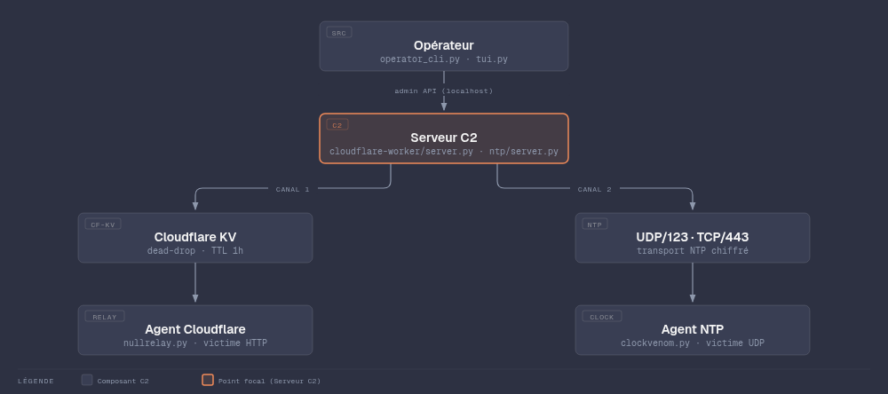
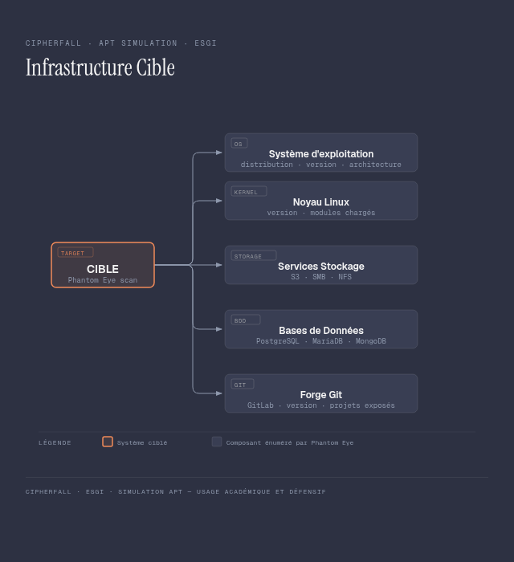
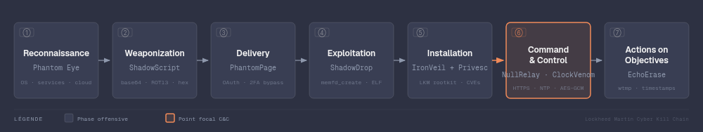

# Document d'Architecture Technique — Cipherfall

**Version** : 1.0  
**Date** : 2026-08-31  
**Projet** : PA5 Cipherfall — Arsenal APT pédagogique  
**Périmètre** : Architecture complète, infrastructure attaquante et infrastructure cible

---

## Table des matières

1. [Contexte et objectif](#1-contexte-et-objectif)
2. [Infrastructure attaquante](#2-infrastructure-attaquante)
   - 2.1 Vue d'ensemble
   - 2.2 Machine opérateur
   - 2.3 Canal C2 Cloudflare Worker
   - 2.4 Canal C2 NTP (VPS)
   - 2.5 Infrastructure phishing
   - 2.6 Arsenal logiciel
   - 2.7 Flux de communication
3. [Infrastructure cible](#3-infrastructure-cible)
   - 3.1 Vue d'ensemble
   - 3.2 Systèmes et services
   - 3.3 Vecteurs d'entrée exploités
4. [Kill chain — flux opérationnel global](#4-kill-chain--flux-opérationnel-global)
5. [Dépendances et choix techniques](#5-dépendances-et-choix-techniques)
6. [Couverture MITRE ATT\&CK](#6-couverture-mitre-attck)

---

## 1. Contexte et objectif

Cipherfall est un framework pédagogique simulant l'arsenal complet d'un groupe APT (*Advanced Persistent Threat*). Le projet couvre l'intégralité du cycle d'attaque : reconnaissance, accès initial, exécution, élévation de privilèges, évasion de détection, commande et contrôle, exfiltration, et effacement des traces.

Ce document décrit l'architecture technique des deux périmètres du projet :

- **Infrastructure attaquante** : ensemble des composants contrôlés par l'opérateur (C2, agents, outils offensifs)
- **Infrastructure cible** : environnement simulé représentant le système d'information d'une organisation victime

---

## 2. Infrastructure attaquante

### 2.1 Vue d'ensemble

L'infrastructure attaquante repose sur trois nœuds physiques/logiques et deux canaux C2 indépendants et redondants.

```
┌─────────────────────────────────────────────────────────────────────────┐
│                        INFRASTRUCTURE ATTAQUANTE                        │
│                                                                         │
│   ┌────────────────┐      Canal 1       ┌──────────────────────────┐   │
│   │    OPÉRATEUR   │ ◄─── HTTPS/443 ──► │  CLOUDFLARE WORKERS + KV │   │
│   │  laptop / VPS  │      (dead-drop)    │  cipherfall-c2.*.dev     │   │
│   │                │                    └──────────────────────────┘   │
│   │  tui.py        │      Canal 2                                       │
│   │  operator_cli  │ ◄─── SSH tunnel ─► ┌──────────────────────────┐   │
│   │  server.py(CF) │                    │     VPS LINUX             │   │
│   │  1337 (admin)  │                    │  87.106.187.97            │   │
│   └────────────────┘                    │  server.py (NTP)          │   │
│                                         │  UDP/123 + TCP/443        │   │
│                                         │  1338 (admin local)       │   │
│                                         └──────────────────────────┘   │
└─────────────────────────────────────────────────────────────────────────┘
```

<p align="center"></p>

### 2.2 Machine opérateur

| Attribut | Valeur |
|---|---|
| Rôle | Poste de commandement — émission de tâches, réception de résultats |
| Forme | Laptop ou VPS (même machine que serveur CF en lab) |
| Interface | `tui.py` (TUI interactif) / `operator_cli.py` (CLI) |
| Ports exposés | Aucun public — API admin locale uniquement |
| Admin CF | `http://127.0.0.1:1337` |
| Dépendances | Python 3.10+, Node.js (wrangler), pip packages |

**Composants présents sur l'opérateur :**

| Fichier | Rôle |
|---|---|
| `Modules/C2/tui.py` | Interface TUI — gestion agents, graphe topologie, payload builder |
| `Modules/C2/operator_cli.py` | CLI — agents/tasks/wait/result |
| `Modules/C2/cloudflare-worker/server.py` | Serveur C2 CF — polling KV, dispatch tâches |
| `Modules/C2/exfiltrate_receiver.py` | Receiver HTTPS pour `/module exfiltrate` |
| Arsenal offensif complet | Voir §2.6 |

### 2.3 Canal C2 Cloudflare Worker

**Principe** : Cloudflare Worker joue le rôle de dead-drop asynchrone. Aucun port public côté opérateur.

| Attribut | Valeur |
|---|---|
| Fournisseur | Cloudflare (Workers + KV) |
| URL Worker | `https://cipherfall-c2.<account>.workers.dev` |
| Stockage | Cloudflare KV — `task:{agent_id}`, `result:{task_id}` |
| TTL tâches | 1 heure |
| Transport agent → CF | HTTPS/443 (GET polling toutes les ~30s ± jitter) |
| Transport opérateur → CF | HTTPS via `server.py` (PUT/GET) |
| Authentification | HMAC-SHA256 sur PSK partagé → header `Authorization` |
| Chiffrement payload | AES-256-GCM bout en bout (opérateur ↔ agent) |
| Coût | ~60 €/an (Workers Paid, 5 €/mois) |

**Flux Cloudflare :**

```
  OPÉRATEUR          SERVER.PY           WORKER.JS          NULLRELAY.PY
                     (local:1337)        (Cloudflare)       (cible)

  task cmd ──POST──► [pending]
                          │ PUT /task/{id}
                          └──────────────────────►
                                                  KV: task:{id}
                                                      │ GET /task/{id}
                                                      └─────────────────►
                                                                  [exec]
                                                      ◄─── PUT /result/ ─┘
                          ◄─── worker delivers ──────┘
  result ◄──GET──── [done]
```

### 2.4 Canal C2 NTP (VPS)

**Principe** : dissimulation du trafic C2 dans des paquets NTP légitimes (extension NTS Cookie RFC 8915). Requiert un VPS avec IP publique et le rootkit IronVeil chargé sur la cible pour la résolution DNS.

| Attribut | Valeur |
|---|---|
| Hébergeur | Hetzner / OVH |
| IP exemple | `87.106.187.97` |
| Ports exposés | UDP/123 (NTP) + TCP/443 (fallback si UDP bloqué) |
| Admin API | `http://127.0.0.1:1338` (local uniquement) |
| Authentification | AES-256-GCM + PSK partagé |
| Transport | NTP Mode-3 (beacon) / Mode-4 (réponse + tâche) |
| Extension utilisée | NTS Cookie field (type `0x0104`) |
| Payload | `AES-256-GCM(zlib(JSON))` dans le champ extension |
| Beacon interval | ~60s ± 30s (configurable live via `/module heartbeat`) |
| Fallback | Si UDP/123 bloqué → TCP/443, même format, longueur préfixée |
| Prérequis cible | `/etc/hosts` compromis par IronVeil + comm process `ntp-agent` |
| Coût VPS | ~60 €/an |

**Flux NTP :**

```
  VICTIME (clockvenom.py)                         VPS (server.py)
  prctl → comm = "ntp-agent"
  resolve 0.debian.pool.ntp.org → IP VPS (via /etc/hosts IronVeil)
  ──── NTP Mode-3 + NTS Cookie [beacon chiffré] ──────────────────►
                                                  déchiffre, log beacon
                                                  tâche en attente ?
  ◄─── NTP Mode-4 [+ NTS Cookie si tâche] ────────────────────────
  exécute commande, chiffre résultat
  ──── NTP Mode-3 [résultat] ──────────────────────────────────────►
```

### 2.5 Infrastructure phishing

| Attribut | Valeur |
|---|---|
| Module | PhantomPage (`phantompage.py`) |
| Technique | Bypass 2FA Microsoft via OAuth Device Authorization Flow |
| Nom de domaine | Domaine crédible similaire à la cible (typosquatting) |
| Fournisseur domaine | OVH / Namecheap (~12 €/an) |
| Certificat TLS | Let's Encrypt (gratuit) |
| Vecteur initial | GitHub malveillant (clone de holehe) — voir Initial Access |

**Mécanisme Initial Access (GitHub supply chain) :**

Un fork de projet Python populaire (ex. `holehe`) est créé. Le script d'installation (`install.sh`) contient l'implant dissimulé après plus de 100 espaces en fin de ligne. L'exécution du script installe le projet légitime et dépose silencieusement l'agent C2.

### 2.6 Arsenal logiciel

| Module | Fichier(s) | Rôle dans la chaîne |
|---|---|---|
| **Phantom Eye** | `Modules/Recon/phantom_eye.sh` | Reconnaissance passive — OS, services, cloud |
| **ShadowScript** | `Modules/Obfuscator/shadowscript.py/.sh` | Obfuscation multi-couches (gzip→b64→ROT13→chunks) |
| **NullRelay** | `Modules/C2/cloudflare-worker/nullrelay.py` | Agent C2 canal Cloudflare |
| **ClockVenom** | `Modules/C2/ntp/clockvenom.py` | Agent C2 canal NTP |
| **Serveur CF** | `Modules/C2/cloudflare-worker/server.py` | Serveur C2 côté opérateur (CF) |
| **Serveur NTP** | `Modules/C2/ntp/server.py` | Serveur C2 côté VPS (NTP) |
| **Worker CF** | `Modules/C2/cloudflare-worker/worker.js` | Dead-drop Cloudflare (JavaScript) |
| **ShadowDrop** | `Modules/Dropper/shadowdrop_*.py` | Dropper fileless via `memfd_create` |
| **PhantomPage** | `Modules/Phishing/deviceflowbypass2fa/phantompage.py` | Phishing bypass 2FA Microsoft |
| **IronVeil** | `Modules/Rootkits/ironveil.c` | Rootkit LKM — hooks DNS, masquage fichiers/PIDs |
| **Stégano** | `Modules/Stégano/stego_embed.py` | Dead-drop PNG — URL payload dans chunk tEXt |
| **EchoErase** | `Modules/Anti-forensics/echoerase_*.sh/.py` | Anti-forensics — historique, audit, masquage |
| **CopyFail** | `Modules/Privesc/copyfail.py` | Privesc — AF_ALG+KTLS splice → écrase `/bin/su` |
| **DirtyFrag** | `Modules/Privesc/dirtyfrag/exp` | Privesc — xfrm/RxRPC page-cache write → root |
| **ssh-keysign PWN** | `Modules/Privesc/ssh-keysign-pwn/sshkeysign_pwn` | Privesc — race pidfd_getfd → vol clés SSH host |
| **Fragnesia** | `Modules/Privesc/fragnesia.sh` | Privesc — CVE-2026-46300, namespace user+net |
| **TUI** | `Modules/C2/tui.py` | Interface opérateur centrale |
| **operator_cli** | `Modules/C2/operator_cli.py` | CLI opérateur |
| **exfiltrate_receiver** | `Modules/C2/exfiltrate_receiver.py` | Receiver HTTPS exfiltration |

### 2.7 Flux de communication inter-composants

| Source | Destination | Protocole | Port | Chiffrement |
|---|---|---|---|---|
| `operator_cli` / TUI | `server.py` (CF) | HTTP | 1337 (loopback) | Non (local) |
| `operator_cli` / TUI | `server.py` (NTP) | HTTP | 1338 (loopback) | Non (local) |
| `server.py` (CF) | Cloudflare Worker | HTTPS | 443 | TLS + HMAC auth |
| `nullrelay.py` | Cloudflare Worker | HTTPS | 443 | TLS + AES-256-GCM |
| `clockvenom.py` | `server.py` (NTP) | UDP/NTP | 123 | AES-256-GCM dans NTS Cookie |
| `clockvenom.py` | `server.py` (NTP) | TCP (fallback) | 443 | AES-256-GCM |
| Agent | `exfiltrate_receiver.py` | HTTPS | 8443 | TLS (self-signed OK en lab) |
| Rootkit IronVeil | Kernel hooks | LKM (syscall) | N/A | N/A |

---

## 3. Infrastructure cible

### 3.1 Vue d'ensemble

L'infrastructure cible représente un système d'information d'entreprise Linux. Elle est composée de serveurs hébergeant des services internes exposés en réseau local, avec accès Internet sortant.

<p align="center"></p>

### 3.2 Systèmes et services

| Couche | Composant | Détail |
|---|---|---|
| **Système** | OS Linux | Debian / Ubuntu / Arch / Fedora / RHEL (cross-compilation IronVeil pour tous) |
| **Noyau** | Kernel Linux | Versions vulnérables aux CVE privesc (DirtyFrag, CopyFail) |
| **Accès** | SSH | Clés privées dans `/root` et `/home`, binaire SUID `ssh-keysign` |
| **Partages réseau** | SMB / NFS | Partages découverts par Phantom Eye (`/etc/fstab`) |
| **Cloud** | AWS / GCP / K8s | Credentials dans `~/.aws/credentials`, ADC JSON, kubeconfig |
| **Bases de données** | MariaDB, PostgreSQL, MongoDB | Credentials dans `~/.pgpass`, `~/.my.cnf` |
| **Services web** | GitLab | Version détectée par Phantom Eye |
| **Stockage objet** | S3 | Buckets découverts par Phantom Eye |
| **Authentification** | Microsoft 365 / Azure AD | Tokens OAuth capturés par PhantomPage (bypass 2FA) |
| **Navigateurs** | Firefox, Chrome/Chromium | `logins.json`, `Login Data` SQLite — récolte par `/module harvest` |
| **Résolution DNS** | `/etc/hosts` | Détourné par IronVeil pour rediriger le trafic NTP vers le VPS C2 |

### 3.3 Vecteurs d'entrée exploités

| Vecteur | Module | Mécanisme |
|---|---|---|
| Supply chain GitHub | Initial Access (holehe clone) | Script d'installation avec implant caché après 100 espaces |
| Phishing 2FA | PhantomPage | OAuth Device Flow Microsoft — capture token access + refresh |
| Fileless execution | ShadowDrop | `memfd_create` — pas d'écriture disque, exécution depuis fd mémoire |
| Redirection DNS NTP | IronVeil (LKM) | Hook `read()` syscall — injecte IP VPS dans `/etc/hosts` pour les domaines NTP |
| Privesc kernel | DirtyFrag / CopyFail | Écrasement SUID `/bin/su` ou `/usr/bin/su` → backdoor SUID bash |
| Privesc SUID | ssh-keysign PWN | Race `pidfd_getfd` sur sortie `ssh-keysign` → vol clés SSH root |
| Privesc namespace | Fragnesia | CVE-2026-46300 — `unshare --user+net` → root dans namespace |

---

## 4. Kill chain — flux opérationnel global

<p align="center"></p>

```
Phase                 Module                 Action
─────────────────────────────────────────────────────────────────────────
1. Reconnaissance     Phantom Eye            Cartographie OS, services, cloud
2. Initial Access     PhantomPage            Phishing device flow — token Microsoft
                      holehe clone           Implant via supply chain GitHub
3. Exécution          ShadowDrop             Dropper fileless memfd_create
4. Obfuscation        ShadowScript           Agents obfusqués avant livraison
5. Stéganographie     Stégano + IronVeil     URL payload dans PNG → dead-drop
6. Persistance C2     NullRelay / ClockVenom Beacon vers CF Worker / VPS NTP
7. Privesc            DirtyFrag, CopyFail,   Escalade root → chargement IronVeil
                      ssh-keysign, Fragnesia
8. Rootkit            IronVeil               Redirection DNS NTP, masquage C2
9. Post-exploitation  /module harvest        Collecte credentials
                      /module download       Exfiltration fichiers
                      /module exfiltrate     Upload vers receiver HTTPS
                      /module recon          Fingerprint cible
                      /module netdiscover    Scan réseau latéral
10. Effacement        EchoErase              Historiques, auditd, logs, artefacts
                      /module suicide        Auto-destruction agent
```

---

## 5. Dépendances et choix techniques

### Côté attaquant

| Composant | Technologie | Justification |
|---|---|---|
| Agents C2 | Python 3.10+ | Stdlib-only, présent sur la majorité des cibles Linux |
| Worker dead-drop | JavaScript (Cloudflare Workers V8) | Infrastructure publique, trafic HTTPS indiscernable |
| KV Store | Cloudflare KV | Pas de serveur exposé côté opérateur |
| Chiffrement | AES-256-GCM | Authentifié, standard, stdlib Python (`cryptography`) |
| Auth Worker | HMAC-SHA256 | Dérivé du PSK partagé — pas de clé à stocker en clair |
| NTP protocol | RFC 5905 Mode-3/4 + RFC 8915 NTS Cookie | Trafic légitime indiscernable, passe les firewalls sortants |
| Rootkit | LKM kretprobes | Hooks au niveau kernel, cross-compilation Docker multi-distro |
| Obfuscation | gzip → base64 → ROT13 + chunks Fisher-Yates | Contourne les règles statiques YARA/regex |
| Dropper | `memfd_create` + `/proc/self/fd/<n>` | Exécution sans écriture disque, contourne EDR file-based |

### Côté infrastructure

| Composant | Fournisseur | Coût |
|---|---|---|
| VPS NTP C2 | Hetzner / OVH | ~60 €/an |
| Cloudflare Workers + KV | Cloudflare (Workers Paid) | ~60 €/an |
| Domaine phishing | OVH / Namecheap | ~12 €/an |
| Certificat TLS phishing | Let's Encrypt | Gratuit |
| **Total** | | **~132 €/an** |

---

## 6. Couverture MITRE ATT&CK

| Tactique | ID | Techniques couvertes | Module(s) |
|---|---|---|---|
| Initial Access | TA0001 | T1566, T1528, T1111, T1078 | PhantomPage, holehe clone |
| Execution | TA0002 | T1620, T1059.004, T1059.006 | ShadowDrop |
| Privilege Escalation | TA0004 | T1068, T1548.001, T1611 | CopyFail, DirtyFrag, ssh-keysign, Fragnesia |
| Defense Evasion | TA0005 | T1027, T1014, T1564.001, T1036.005, T1070, T1140, T1601.001 | ShadowScript, IronVeil, EchoErase |
| Credential Access | TA0006 | T1528, T1111 | PhantomPage, `/module harvest` |
| Discovery | TA0007 | T1082, T1016, T1049, T1526, T1087.001 | Phantom Eye, `/module netdiscover` |
| Command & Control | TA0011 | T1071.001, T1095, T1572, T1008, T1573.001, T1102.003, T1102 | NullRelay, ClockVenom, IronVeil, Stégano |
| Exfiltration | TA0010 | T1041, T1027.003 | NullRelay, ClockVenom, `/module exfiltrate` |

**Récapitulatif** : 7 tactiques couvertes / 14 · 30 techniques uniques · 10 modules offensifs.

---

*Pour le déploiement : voir [MI.md](./MI.md). Pour l'utilisation opérationnelle : voir [MEX.md](./MEX.md).*
